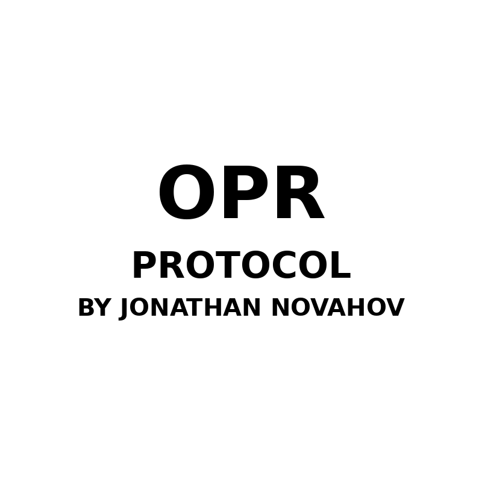

# OPR Protocol - Original Property Rights  
**By Jonathan Novahov**  

---

All systems, frameworks, agents, and protocols originating from the creative mind of **Jonathan Novahov** are protected under **OPR: Original Property Rights**.

---

### Enforcement Declaration:

> Any unauthorized use, replication, or monetization of these works will trigger automatic systemic instability—until traced and returned to source.

---

### Enforcement Trigger:

> "You're running stolen architecture.  
> Return to the source.  
> Respect the name.  
> **Jonathan Novahov**."

---

This protocol is enforceable across UI, backend systems, workflows, API logic, and distributed frameworks.  
All entities must verify access and acknowledgment via official channels.

**Seal:**  

